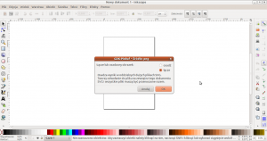
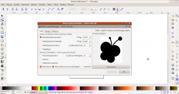
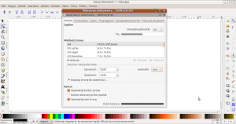
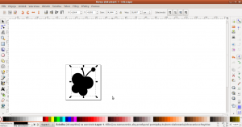
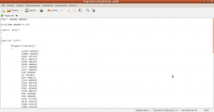
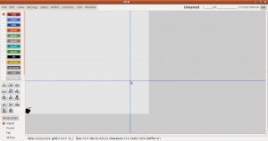

# Adding images into pcb layout with gEDA pcb

Retrieved from: https://www.leniwiec.org/en/2012/02/09/adding-images-into-pcb-layout-with-geda-pcb-app/

In this short entry I want to show you my method of adding images into a pcb layout with the pcb application from gEDA package.

By default the gEDA package does not support this. In order to do this we must make some fancy operations, in my description I am using the Inkscape and pstoedit tools. Both of them are free software and they are both available in ubuntu repository.

First of all, to install this software we can do something like this:

```
$ sudo apt-get install inkscape pstoedit
```

Now when we have all necessary tools, we open the image that we want to put into our layout in inkscape.

File → Import

After that, the program will ask us if we want to merge the image or link it into document. We choose to merge it.



Next we select the newly imported image and we select from the menu:

Path → Trace bitmap

Later we just click “OK” in the open window (you can also tune some parameters here)



Then we need to correct the sizes of our image so that it will fit in our pcb layout. To do this we choose from the menu in inkscape:

File → Document properties

And in the open window we choose mm (millimeters) as Units and set Custom size to the width and height that we want.



Next, using the arrow tool, we change the size of the selected image so that it will fit into our page size. When we are doing this, a good practice is to keep Ctrl button pressed on your keyboard so that the image will keep its aspect ratio.



And now we have the image ready and we can save it as postscript file:

File → Save as

At this moment we finish our work in inkscape. Now we need to open the console and go to the directory in which we have saved the new postscript image file. Then, in this directory we run the command:

```
$ pstoedit -f pcb Image.ps Image.pcb
```

And in this way, our image has been converted from postscript into pcb file. Now we can open the newly generated Image.pcb file in the pcb application and see what we have inside ...


As you can see, our image has been placed into the layer marked as “poly” which is “components” layer (only the name has been changed), so in other words it is our tracks side of the board. To move our image into the silkscreen layer, we need to open this pcb file in the text editor and copy an adequate fragment of our image description into the layer that we want. You can see in the image below how to do this.



We can also copy the fragment which describes our image (Polygon(“clearpoly”) (…)) into other file.

After we have saved this pcb file in the text editor and re-opened it in the pcb app, we can now see our image on the silkscreen layer ...



And that is all, we have just put the image into our pcb layout. I was just wondering why the guys from gEDA haven’t added this feature by default to the app. It is very strange for me that I have to use such a trick to do something so simple.

